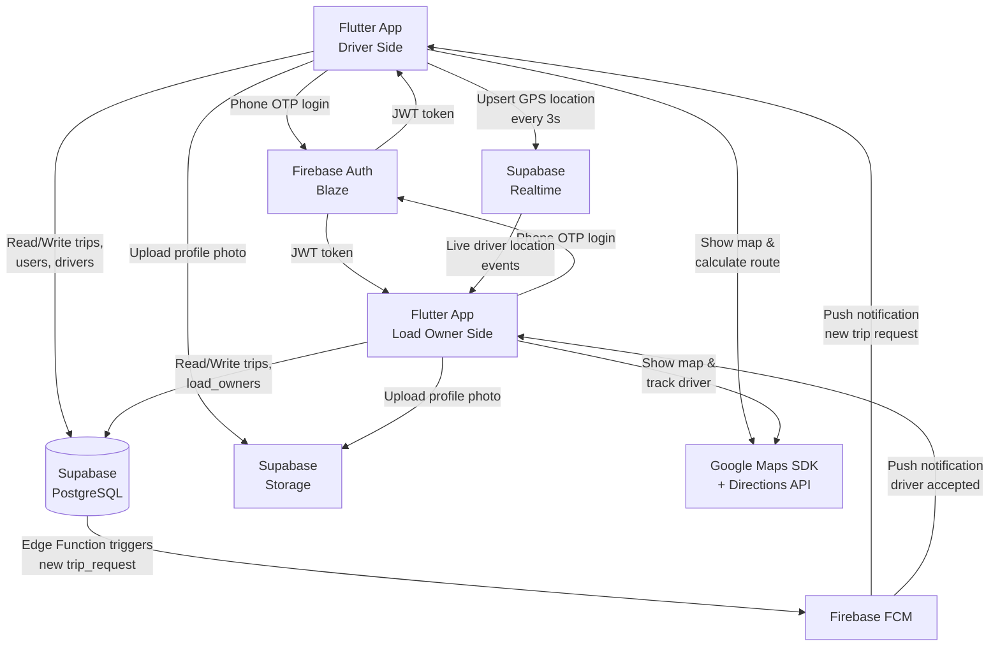
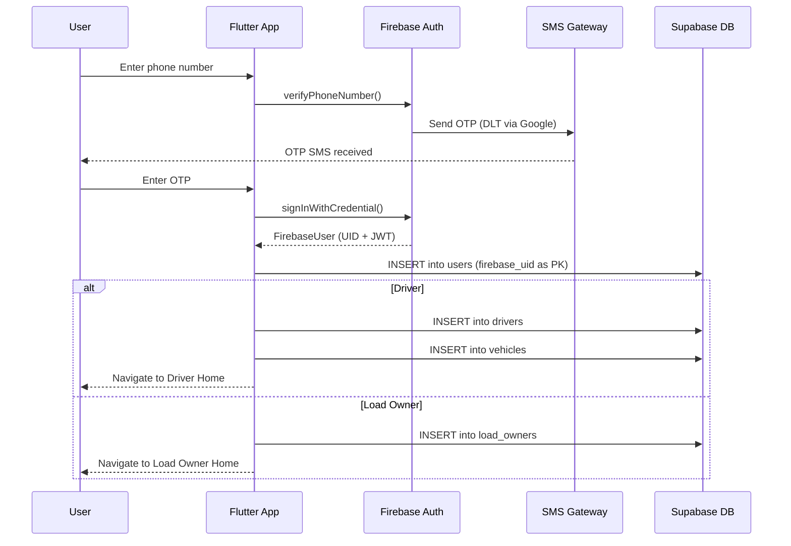
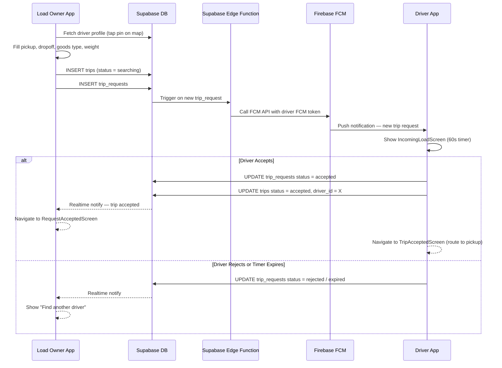
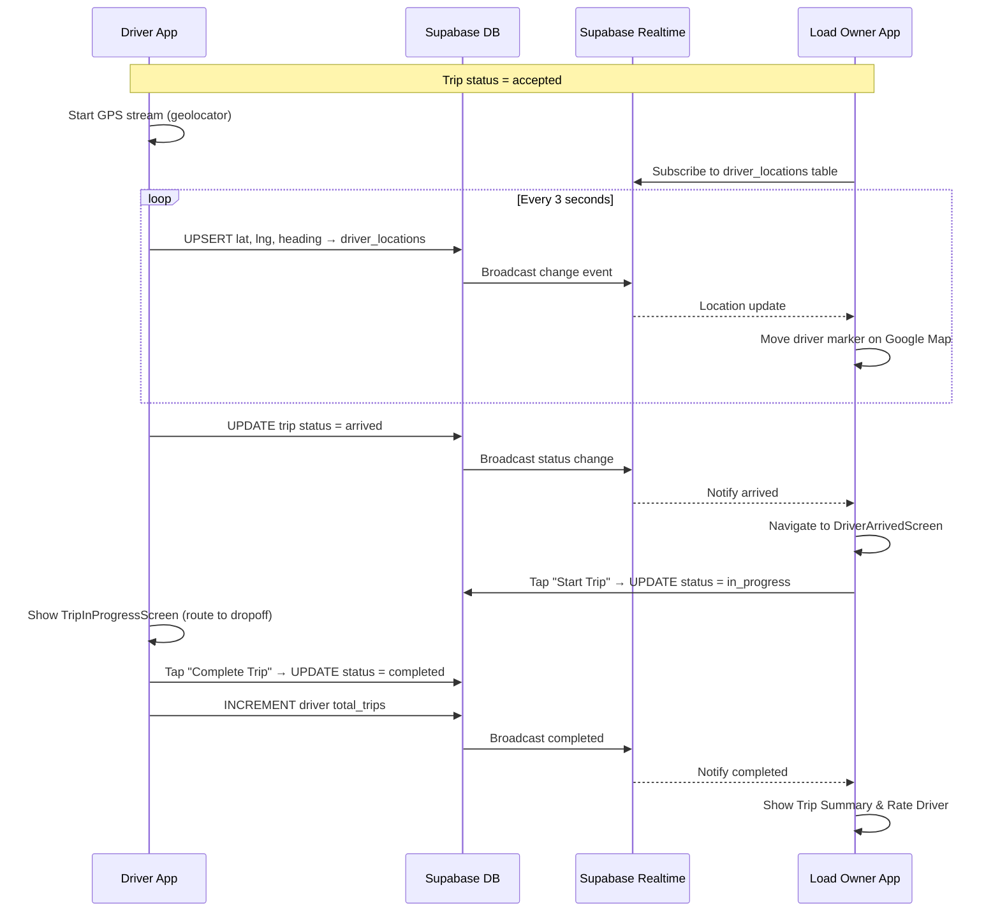
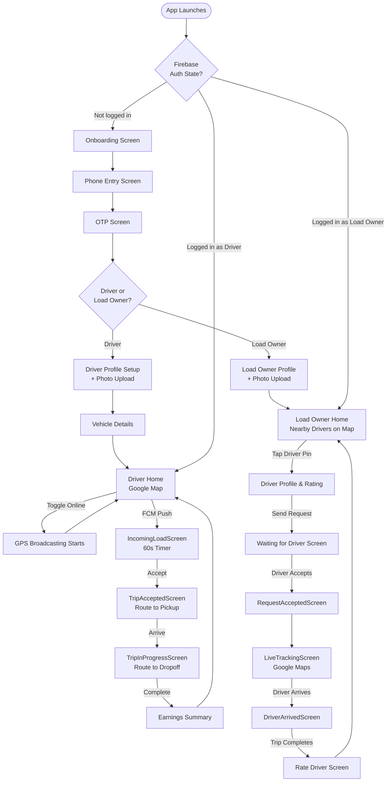

# TripJio Diagrams

---

## Diagram 1 — System Architecture

---

## Diagram 2 — Auth Flow

---

## Diagram 3 — Trip Request Flow

---

## Diagram 4 — Live Tracking Flow

---

## Diagram 5 — App Screen Flow

